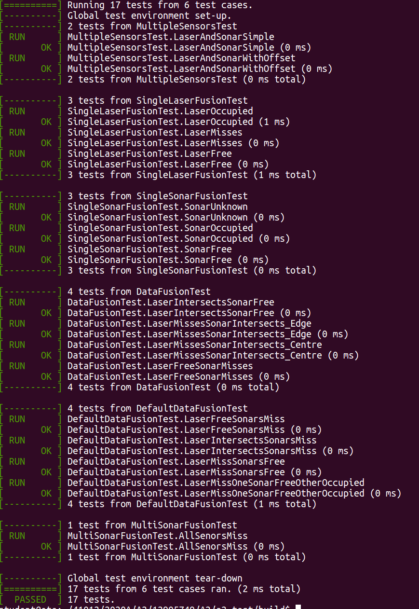

# Instructions for using teh a2-tests#

## Preparing the tests

Drop this folder into the folder with your code (Example of your A2 submission code and a2-test)


Compilation expects certain source files to exist in the directory one-level up as per Assignment specification

Run the following command from within the directory:
```
mkdir build; cd build; cmake ..; make rawTests; make fusionTests
```

If the make fails, ***you would have a filesystem, constructors or functions*** incompatible with requirements specified in Assignment.

Common failures are:
* No default constructor
* Functions modified from the interface files

## Running Raw TESTS ##

Execute
```
./rawTests
```
This will run 7 tests in 3 Groups


The tests map to criteria in the Marking Sheet highlighted in yellow

## Runing Fusion Tests ##

Execute
```
./rawTests
```
This will run 17 tests in 6 Groups



The tests map to criteria in the Marking Sheet highlighted Green


## Pure Virtual

Run the following command from within the directory:
```
cmake .. --DCHECK_PURE_VIRTUAL=TRUE; make pureVirtualTests
./pureVirtualTests
```

This test should fail, map to criteria in the Marking Sheet highlighted Orange


## Final comments

If you pass all tests then you have aced the components noted in colour on the Marking Sheet :thumbsup:
