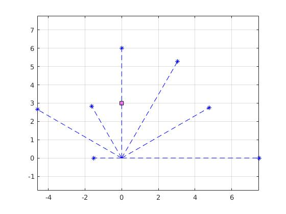
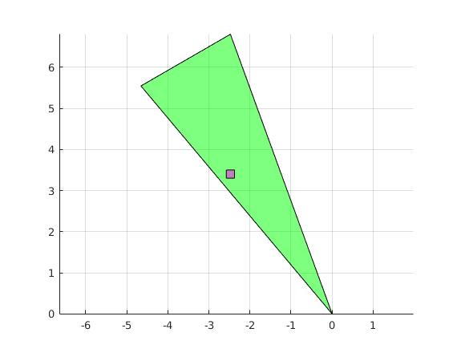
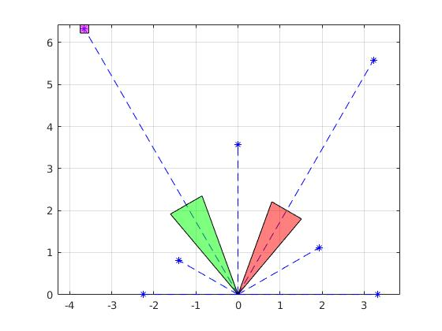

## Usage

Drop this folder into the area where your A2 code exists. Compilation expects certain source files to exist in the directory one-level up.

Run the following command from within the directory:
```
mkdir build; cd build; cmake ..; make; ./rawTests; ./fusionTests
```

## Raw TESTS

There are 2 test cases: 
DataDistanceTest (2 tests, Laser and Sonar)
MultipleSensorsTest (2 tests)

## Fusion Tests

There are 3 test cases: 

SingleLaserFusionTest: Laser intersects cell (State::FREE) 



SingleSonarFusionTest: Sonar covers cells (State::FREE)



DefaultDataFusionTest: laser return in cell, both sonars miss the cell (State::OCCUPIED)



